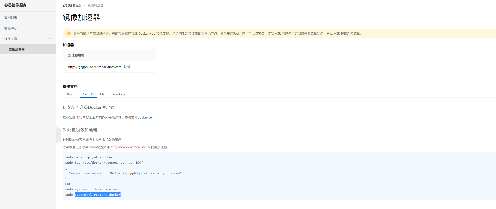

<!-- <font color='green'>你好</font> -->
<!-- 
| 姓名 | 作为 | 年龄 |
| --- | --- | --- |
| lin | wq | 18 | -->

## 安装docker
### 卸载原先的docker环境
```sh
yum remove docker \
             docker-client \
             docker-client-latest \
             docker-common \
             docker-latest \
             docker-latest-logrotate \
             docker-logrotate \
             docker-engine 
```


### 安装yum-utils
```
yum install -y yum-utils
```


### 安装 yum-config-manager
```
yum-config-manager --add-repo https://download.docker.com/linux/centos/docker-ce.repo
```


### 安装 Docker Engine
```
yum install docker-ce docker-ce-cli containerd.io docker-buildx-plugin docker-compose-plugin
```


### 设置Docker开机自启
```
systemctl enable docker
```


### 启动Docker服务、关闭Docker服务
```
systemctl start docker ## 启动Docker
systemctl stop docker ## 关闭Docker
```


### 在控制台输入docker -v 出现版本号即安装成功
```
docker -v
```


## 设置阿里云镜像源
[啊里云镜像源](https://cr.console.aliyun.com)


### 按提示操作



## Docker Compose安装
### 安装curl（当然基本都自带）
```
yum install curl
```


### 安装Docker Compose
```
curl -L "https://github.com/docker/compose/releases/download/1.29.1/docker-compose-$(uname -s)-$(uname -m)" -o /usr/local/bin/docker-compose-curl v-L"
```


### 添加执行权限
```
chmod +x /usr/local/bin/docker-compose
```

在控制台输入docker-compose -v 出现版本号即安装成功


## docker安装nginx
```
#直接安装nginx镜像运行nginx容器
[root@localhost docker]# docker run -d -p 80:80 --name mynginx nginx
#进入容器 复制文件到容器同上，不在累述
#数据挂载  (把容器文件挂载到宿主机上面,不用每次进入容器内部修改文件，在容器外部宿主机修改文件会自动同步到容器内部，并且当删除容器后，宿主机上的文件不会被删除，相当于对容器内部文件进行持久化操作。)
[root@localhost docker]# docker run -d -p 8033:80 -v /data/nginx/html:/usr/share/nginx/html --name mynginx nginx
#在/data/nginx/html目录下创建test.html
[root@localhost html]# vim test.html
#测试成功
[root@localhost html]# curl localhost:8033/test.html
--------------------------------------------------------------------------------------
[root@localhost docker]# docker run -dit -p 8081:80 -v /data/nginx/conf:/etc/nginx -v /data/nginx/log:/var/log/nginx -v /data/nginx/html:/usr/share/nginx/html --name nginx1 nginx /bin/bash
# 说明：当挂载容器内安装软件配置目录容易出现很多问题，比如：1.后台启动即退出 2.成功启动后无法正常访问
[root@VM_0_5_centos conf]# curl localhost:8081
curl: (56) Recv failure: Connection reset by peer
```