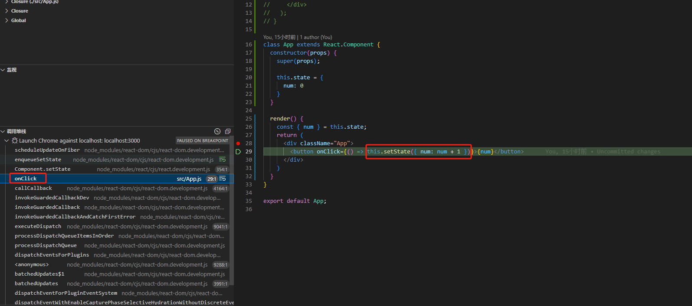
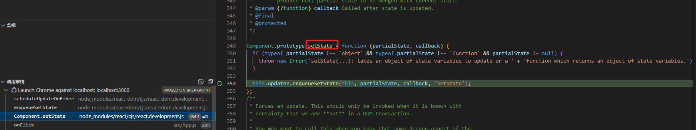
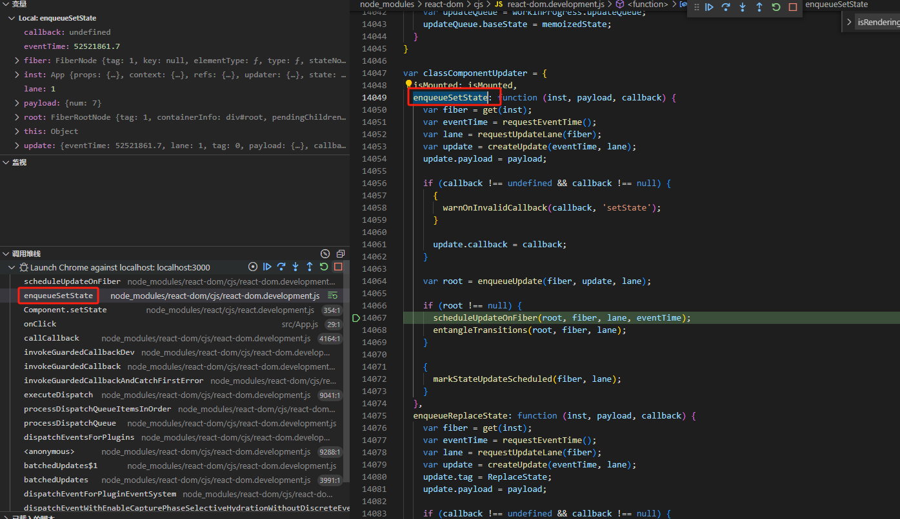

## 简述
react中的类组件是通过setState来实现数据改变时视图相应地做出改变，现在通过按钮点击事件触发setState，看看整个流程是怎么变化的

## 流程分析
### 触发react的onClick事件

撇除react的事件合成机制和批量更新，从点击事件开始看setState的整个流程

### 类组件中的setState

可以看到setState是挂载在类组件中的prototype上的，我们通过调用this.setState,实际上就是调用原型上的setState方法

#### 参数
1. partialState：合成后的state，可以是对象，也可以是函数，函数需要返回一个合成后的对象。
2. callback：state改变后立即调用的回调函数

#### 运作逻辑
调用updater对象的enqueueSetState，打开更新的主体流程

### enqueueSetState

enqueueSetState是classComponentUpdater对象的属性

#### 参数
1. inst：当前组件实例
2. payload：合成后的state对象
3. callback：state改变后立即调用的回调函数

#### 运作逻辑
1. 通过组件实例获取组件的fiber对象
2. 获取本次更新的lane，此属性主要为本次更新调度的优先级
3. 创建update对象，将payload(合成后的state对象)和callback(state改变后立即调用的回调函数)赋值成update对象的属性
4. 通过enqueueUpdate方法将当前更新对象推入react的更新队列中(fiber.updateQueue)
5. 通过scheduleUpdateOnFiber根据优先级开始更新调度(等调度时再好好研究这个方法)

